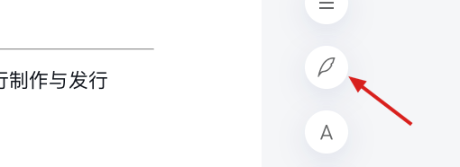
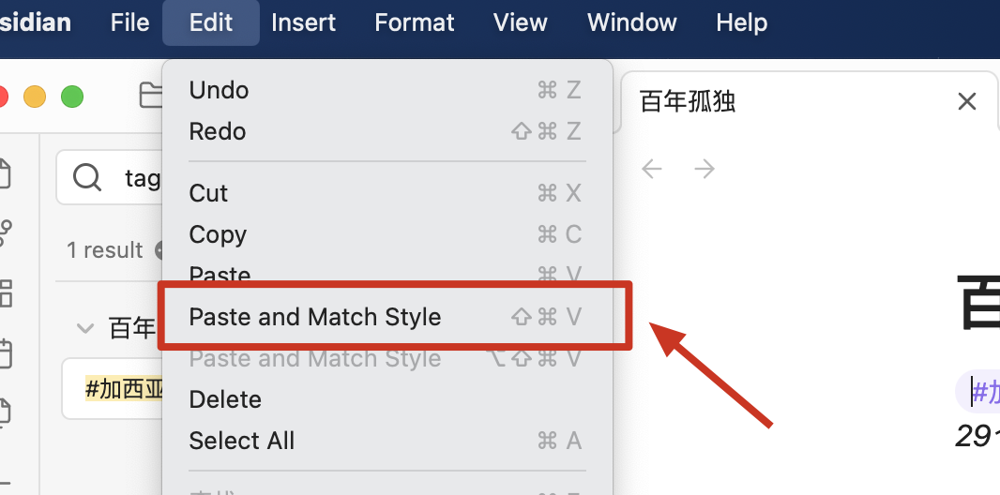
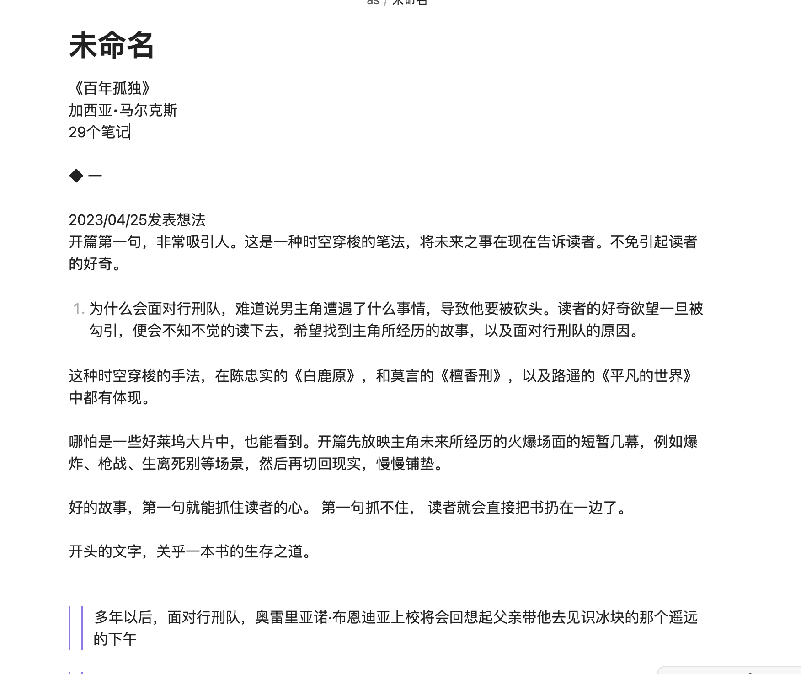
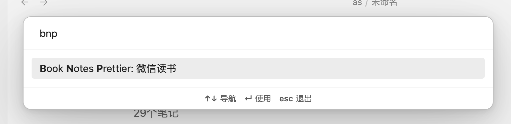

# 读书笔记格式化插件

# 功能

-   支持微信读书笔记
    -   支持笔记格式化
    -   支持文件标题自动重命名

# 使用方式

## 微信读书

1. 打开 r.qq.com, 并登录你的账号
2. 打开你的一本书，点击笔记按钮， 然后点击复制全部笔记

3. 打开 obsidian, 并新建一个笔记, 粘贴文本。

⚠️： **文本粘贴必须用 Paste And Match Style**， mac 版本的快捷键是`cmd + shift + v`, windows 版本的可以自行探索

粘贴后的笔记格式如下：

4. 最后一步，打开命令窗口。mac 上的快捷键是`cmd + p`, 输入 bnp, 然后可以看到， Book Notes Prettier: 微信读书这个命令， 点击或者选择执行这个命令

5. 执行之后的最终效果

